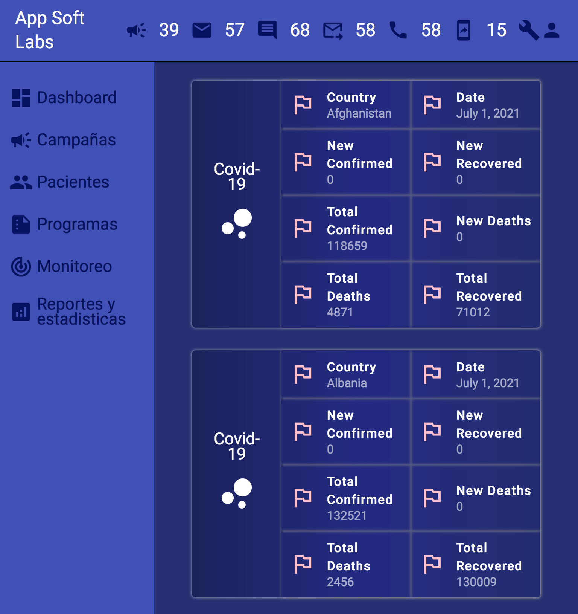

# App que muestra estadisticas sobre covid 19

Hacemos una llamada a la API https://api.covid19api.com y mostramos en pantalla los resultados por cada pais.

Usamos Css, Html y JavaScriipt con ##Angular.

Link: https://app-test-git-develop-deymerh.vercel.app/

